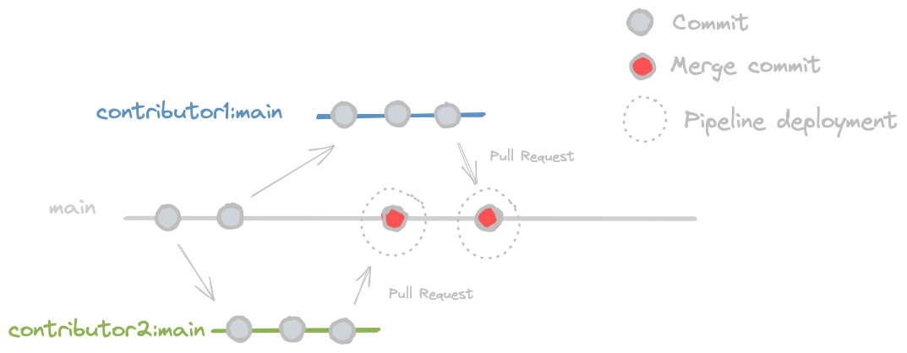

# Contributing to JSM.FluentValidation.AspNet.AsyncFilter

The key words `MUST`, `MUST NOT`, `REQUIRED`, `SHALL`, `SHALL NOT`, `SHOULD`, `SHOULD NOT`, `RECOMMENDED`, `MAY`, and `OPTIONAL` in this document are to be interpreted as described in [RFC 2119](https://www.ietf.org/rfc/rfc2119.txt).

## Contributing with code or documentation

This repository uses [trunk based development](https://github.com/cgbystrom/awesome-trunk-based-dev). The picture below depicts what you must follow to properly contribute to this project:

Follow the steps below if you want to contribute with `JSM.FluentValidation.AspNet.AsyncFilter`:

- Firstly, you should search in [issues](https://github.com/juntossomosmais/JSM.FluentValidation.AspNet.AsyncFilter/issues) something that you want to work with. You could filter those with `help wanted` (Good for community contributors to help, up-for-grabs) or `good first issue` labels;
- To contribute, you must create a `fork` from this repo;
- Then, you must create your commits and push them in your forked repo;
- It's recommended to use [conventional commits](https://www.conventionalcommits.org/en/v1.0.0/) in your commit summary;
- After all commits, you should open a PR from your branch in the forked repo to the source repo `main` branch;
- Maintainers will review your pull request ASAP and they can approve it or request updates;

## Contributing with issues or questions

Another way to contribute is creating an [issue](https://github.com/juntossomosmais/JSM.FluentValidation.AspNet.AsyncFilter/issues). Feel free to write as many issues as you want, they are very important to help us launching new releases and solving bugs. It's recommended to label you issue with any one of the following labels: `question`, `bug` or `enhancement`.

## Package version

The package is published in [nuget](https://www.nuget.org/packages/JSM.FluentValidation.AspNet.AsyncFilter) and the version control is one of the maintainer's responsibilities. Even if you have already made a merge request to this repo, the package version will be updated only after a maintainer edit on [JSM.FluentValidation.AspNet.AsyncFilter.csproj](https://github.com/juntossomosmais/JSM.FluentValidation.AspNet.AsyncFilter/blob/main/src/JSM.FluentValidation.AspNet.AsyncFilter.csproj#L9).
